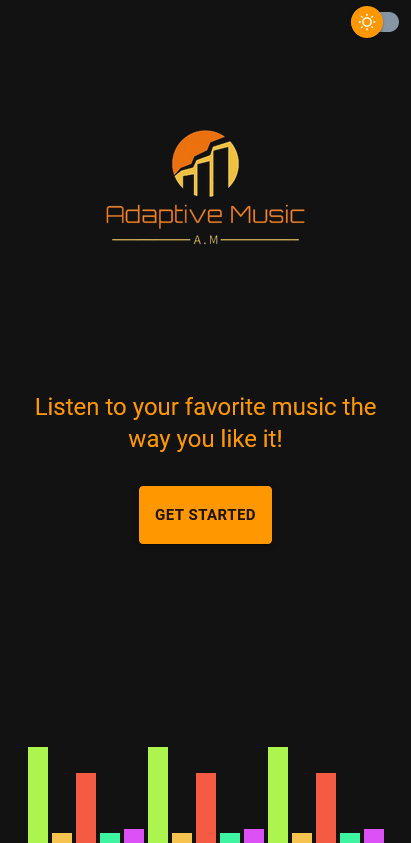
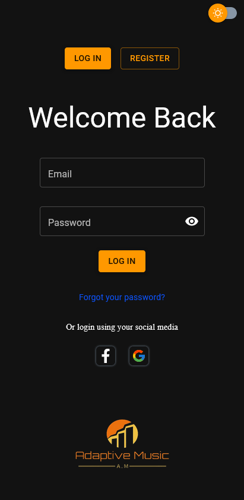
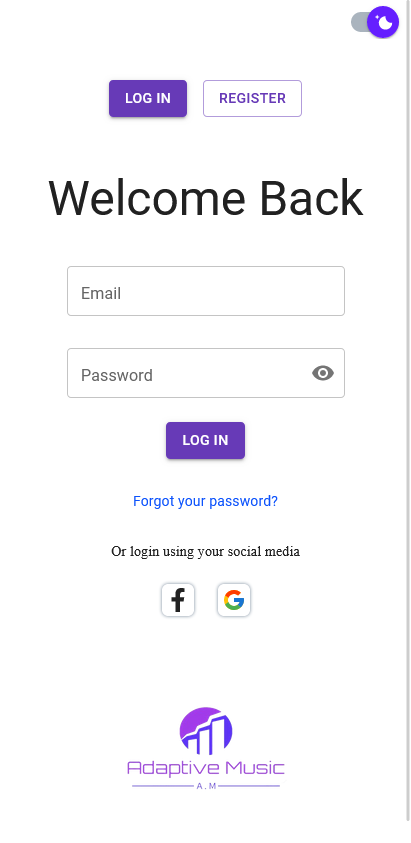
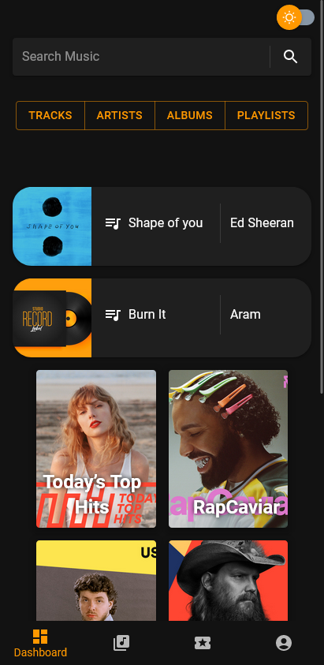
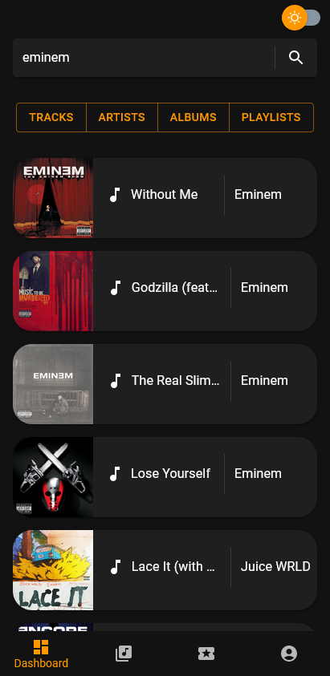
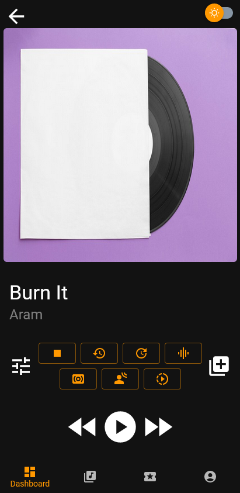
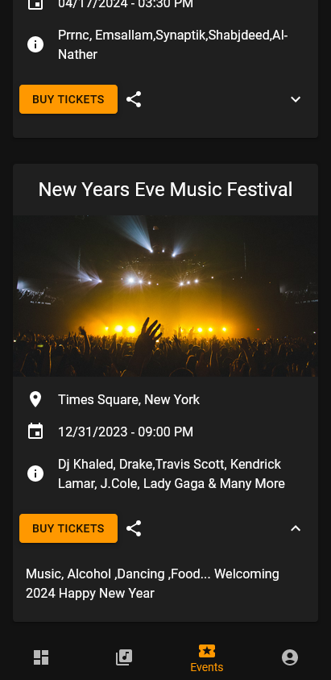
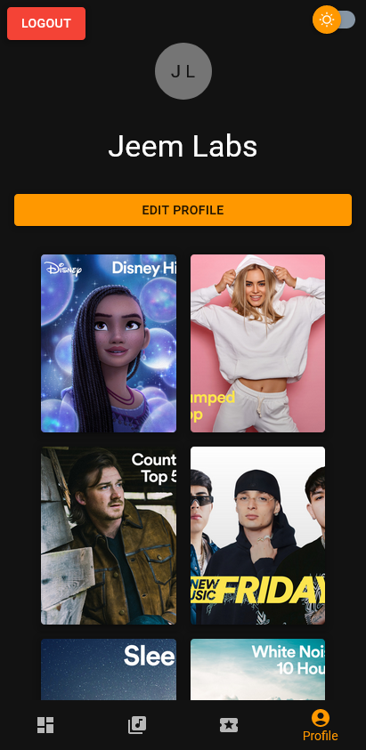

# Adaptive Music React Web Application

Adaptive Music is a feature-rich React web application that leverages Firebase authentication, Firestore, the Spotify Web API, Tone.js library, and Material UI to provide a seamless music streaming experience. The application focuses on adaptability, allowing users to customize their music playback with various effects. Additionally, it includes an events page where artists can showcase upcoming events, creating a dynamic and engaging platform.

#### Link :- https://adaptive-music.netlify.app/

## Features

1. **Authentication and Authorization:**

    - Users can register, log in, and reset their passwords securely using Firebase Authentication.
    - MIT licenses ensure secure user access and data protection.

2. **Music Streaming:**

    - Integration with the Spotify Web API enables users to search for artists, tracks, albums, and playlists.
    - Users can create and manage their playlists, adding a personalized touch to their music library.
    - Tone.js library empowers users to add effects to playing tracks, including tempo adjustments, compressor, pitch shift, chorus, and reverb.

3. **Responsive Design:**

    - Material UI components provide a responsive and visually appealing interface.
    - Dark and light mode can be toggled using a switch button, enhancing user experience.

4. **Events Page:**

    - Artists can add events with details such as title, lineup, location, date, time, and description.
    - All users can view upcoming events on the dedicated Events page.

5. **Dashboard:**

    - The user dashboard features a search functionality, allowing users to discover new tracks and artists.
    - Top Spotify playlists are displayed for quick access.

6. **Library:**

    - The Library section contains all playlists and albums that users have added or created.

7. **User Profiles:**

    - Users can personalize their profiles by changing their display names.
    - Logout functionality ensures secure session management.

8. **React Router Dom:**

    - Implementation of React Router Dom with BrowserRouter, Routes, Route, useHistory, useParams, and useNavigate for seamless navigation.

9. **Animations:**
    - Animations enhance the user experience, making interactions more dynamic, such as when searching or clicking on tabs, tracks, or albums.

## Pages

1. **Welcome Page:**

    - Introduction and overview of the Adaptive Music application.

2. **Login/Register/Forgot Password:**

    - Secure authentication pages for user access.

3. **Dashboard:**

    - Central hub for searching, exploring top playlists.

4. **Library:**

    - Displays playlists and albums added or created by the user.

5. **Events Page:**

    - Features upcoming events added by artists.

6. **Profile Page:**
    - Allows users to customize their display names and logout.

## Technologies Used

-   React.js
-   Firebase Authentication and Firestore
-   Spotify Web API
-   Tone.js library
-   Material UI
-   Axios library for data fetching
-   React Router Dom for navigation

## Conclusion

Adaptive Music combines cutting-edge technologies and a user-friendly interface to create an immersive music streaming experience. The ability to personalize playback with effects, discover new music, and engage with events sets it apart as a dynamic and adaptable platform for music enthusiasts.

## App Preview

